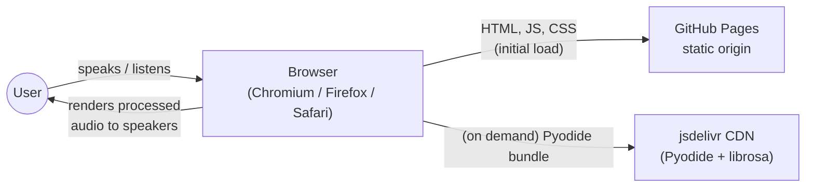
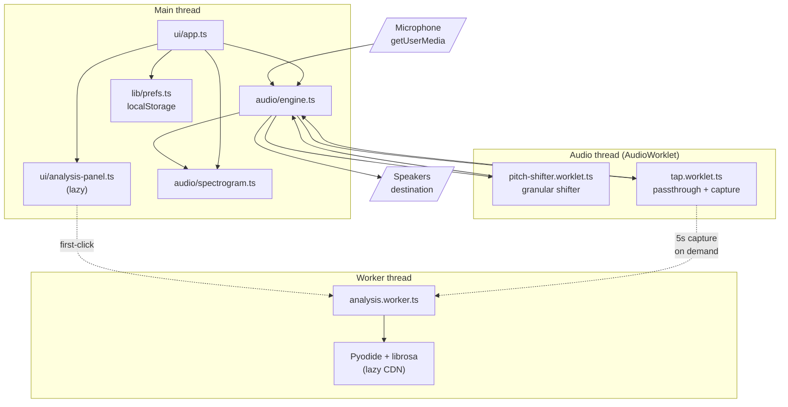

# Architecture

A one-page summary of how time-displaced-ears is wired. For the rationale behind individual decisions, see `docs/adr/`.

## C4 — System context

There is no other system in scope — no API, no database, no auth provider.

## C4 — Container view (inside the browser)

Notes:

- The capture-tap branches off the post-filter, pre-delay node so what the analysis worker sees matches what the user is currently saying, not what they said 7 seconds ago.
- `analysis.worker.ts` and Pyodide are loaded only when the user clicks "Capture & analyze" — initial-page JS is well under 200 KB gzipped.
- All audio data stays inside the browser. The only outbound request is to `jsdelivr.net` for the optional Pyodide bundle.
